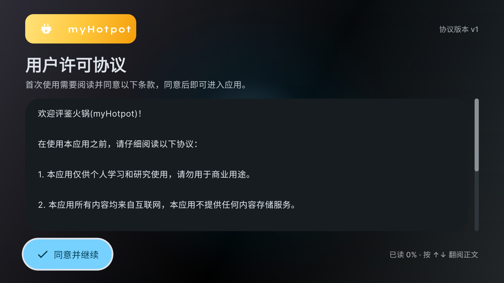
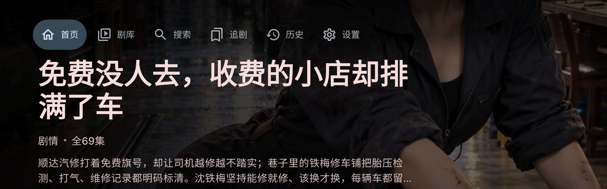
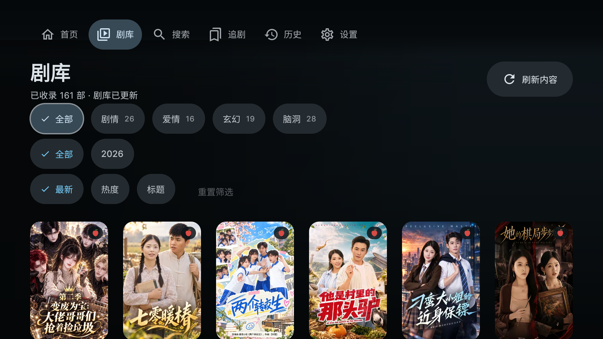
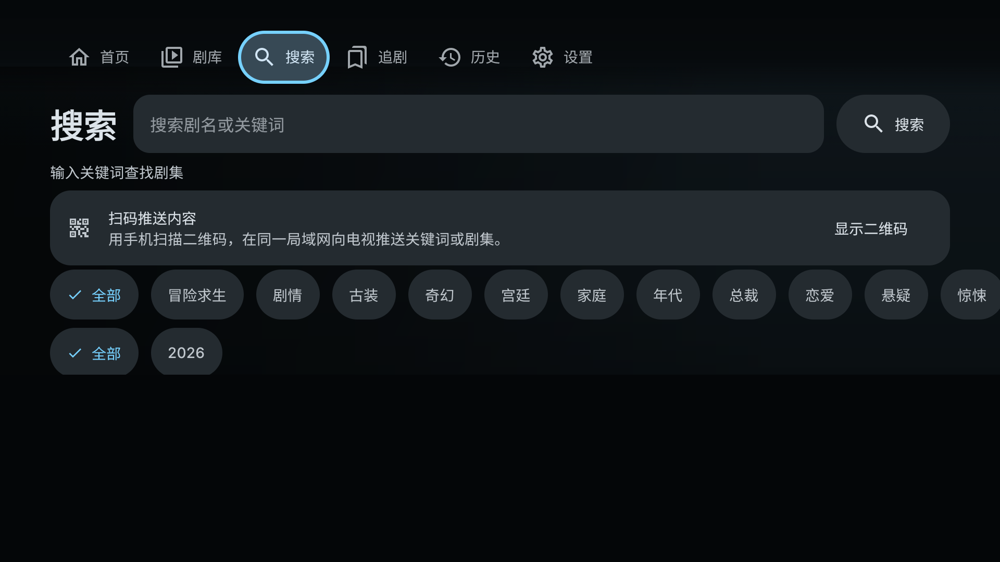
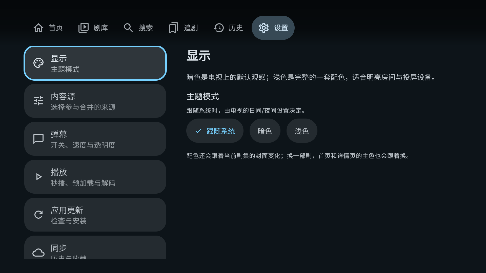
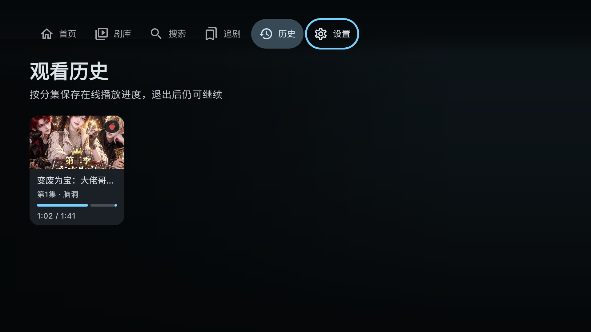

# myHotpot 🍲

在此感谢L站大佬fish2018的无私分享。

> **短剧爱好者的电视火锅。** 沙发一瘫，遥控器一按，好戏开涮。

一个跑在 Android TV 上的短剧播放器。没有开屏广告，没有算法轰炸，打开就是剧——
遥控器上下左右，就能涮完一整部。

## 🥘 这是什么锅底

- 📺 **为电视而生**：专为大屏和遥控器设计的 Compose TV 界面，焦点、动效、层级退出都是顺着电视逻辑来的
- 🧩 **内容源自选合并**：内置多个短剧内容源，开关自己说了算，首启默认只开一个，干净
- ⚡ **秒播与预加载**：选集切换基本不用等，进度条刚走完，下一集已经涮上了
- 🎬 **清晰度可调**：480p / 720p / 1080p 随网速切换，默认 1080P
- 💬 **弹幕**：开关、速度、透明度全可调，一个人看剧也能满屏吐槽
- 🎨 **主题跟着剧走**：暗色 / 浅色 / 跟随系统，主色还会跟着当前剧的封面变化——换一部剧，换一套配色
- 📱 **手机扫码推送**：电视上打字是酷刑，扫个二维码，用手机把关键词或剧集推进电视里
- 🧾 **看到哪记得哪**：继续观看、观看历史按分集保存，退出重进接着涮
- 🔄 **应用内更新**：新版本自己会敲门，不用找 U 盘装 APK

## 📺 出锅实拍

以下截图全部来自默认内容源，Android TV 模拟器实拍。

| 首次启动 · 先立个协议 | 首页 · 大字海报 + 推荐流 |
| :-: | :-: |
|  |  |

| 剧库 · 库存、题材、年份、排序一屏搞定 | 搜索 · 懒得打字？手机扫码推送 |
| :-: | :-: |
|  |  |

| 详情页 · 评分、热度、标签、选集一锅端 | 播放器 · 进度、选集、清晰度全在 |
| :-: | :-: |
|  |  |

| 设置 · 显示、内容源、弹幕、播放、更新 | 观看历史 · 按分集保存，退出仍可继续 |
| :-: | :-: |
|  |  |

## 🕹 遥控器说明书

| 按键 | 干嘛 |
| :-: | :-: |
| 方向键 | 移动焦点、翻列表 |
| 确认键 | 播放 / 暂停 |
| 左右 | 快进 / 快退 |
| 上 | 选集面板 |
| 下 | 播放设置（清晰度等） |
| 返回 | 分级退出：先收控制条和浮层，再按两次才退出播放——防手滑 |

## 🚀 安装

1. 到 [Releases](https://github.com/mytv-android/myhotpot/releases) 页面下载对应架构的 APK（arm64-v8a / armeabi-v7a / x86 / x86_64，应用内更新只会下你设备需要的那一份）
2. 拷贝到电视 / 电视盒子上安装
3. 打开，同意协议，开始涮

## ⚠️ 免责声明

- 本项目仅供**个人学习与研究**使用，请勿用于商业用途
- 所有内容均来自互联网，本项目不提供任何内容存储服务
- 如果某个源临时抽风，页面上会给你一个「重试」按钮——上游的事，让它自己缓

## 🧾 关于

名字来自火锅（Hotpot）：一部一部短剧，就是一盘一盘的菜，电视是锅，你是食客。

有问题请到 [Issues](https://github.com/mytv-android/myhotpot/issues) 提，好用请给个 ⭐。

